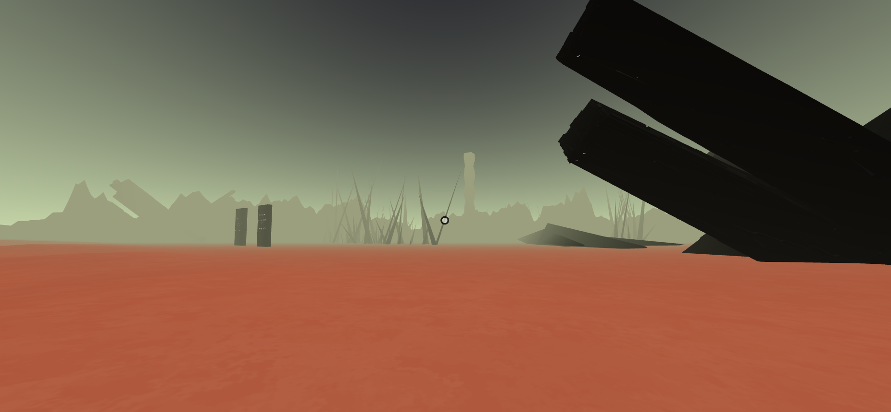

# vr_wipp

## Overview
This vr project attempts to bring to life a vision of the Waste Isolation Pilot Plant ([WIPP](https://en.wikipedia.org/wiki/Waste_Isolation_Pilot_Plant)) initial work which attempted to create a future-proof warning system that would last as long as the nuclear waste itself, through symbolism and aggressive architectural designs.

For more information, view:

[Why danger symbols can't last forever](https://www.youtube.com/watch?v=lOEqzt36JEM) by Vox

[Future Generations Need to Know Our Nuclear Waste Is Deadly. How Can We Tell Them?](https://www.youtube.com/watch?v=PUXwrWMS-x8) by The Nation

## Usage
In order to access the project, you must run it locally. This can be done simply through Ritwick Dey's [Live Server](https://marketplace.visualstudio.com/items?itemName=ritwickdey.LiveServer) extension for Visual Studio Code.

## Libraries and dependencies

The project is built upon [A-Frame](https://aframe.io/) and Supermedium's [aframe-environment-component](https://github.com/supermedium/aframe-environment-component) All components and entities were custom created using Blender except for the [radioactive barrels](https://www.turbosquid.com/3d-models/free-barrel-radioactive-3d-model/1014400).

## Difficulties

- Inclusion of chinese and arabic character set for the monoliths was attempted through https://msdf-bmfont.donmccurdy.com/ but ultimately abandoned due to the lack of support for [multi-page bitmap fonts](https://github.com/donmccurdy/msdf-bmfont-web/issues/9). Creating a custom character set for each different sentence was also attempted but was deemed impractical.

- Due to aframe-environment-component's [hard coded stage size](https://github.com/supermedium/aframe-environment-component/issues/75), mountains were designed in Blender and imported to serve as the outer walls of the scene. 

- Although the project benefits from the mostly-black aesthetic of the structures, texture work was not able to be further developed because of GLTF texture requirements that did not allow to export some shaders used in Blender.

- Due to browsers only allowing audio to be played after user interaction, a "begin experience" screen was added. When the user clicks it, audio begins playing. Inspired by  (Lee Stemkoski's)[https://github.com/stemkoski/A-Frame-Examples/blob/master/fade-in.html] solution.

Overall, the project was a personal success as I was able to gain a certain level of proficiency within Blender (software I had not previously used), being able to create and texture multiple components of various shapes for the project.

## Preview

## Author

Project developed by Fábio Cabral as a final project for the "Réalité virtuelle et augmentée" class by Professor [Isaac Pante](https://github.com/ipante) at University of Lausanne during the Spring semester of 2022.